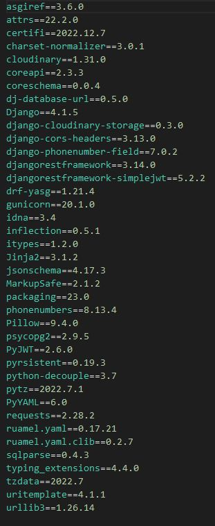

# Let's Meet! - API
[View the live project here](https://letsmeet-api.herokuapp.com/)

## Introduction
"Lets Meet" is a website designed to help people find their interest groups and meet new people! The website can be used by anyone planning an event, a trip, a hike, or anything and find people sharing their interests, and either join them or invite them to be a part of your own group.
This part of the project is the Backend for our app. This API is built upon Django-REST framework, for data handling of our ReactJS front-end.

# User Story <a name="stories"></a>
- As a User, I can easily signup/register to the website so that I can browse the website freely.
- As a User, I can easily login, so that I can access the features of the website exclusive to logged in users.
- As a User I can easily determine whether I am logged in or not so that I can perform actions accordingly.
- As an Admin I can refresh access tokens so that users can remain logged in.
- As a User I can easily access the navigation bar from any page so that I can navigate through the website conveniently.
- As a User I can scroll through the page indefinitely so that I don't have to keep navigating to different pages.
- As a User I can create new events so that I can invite people to join or meet.
- As a User I can easily browse all the posted events so that I can find my interest group.
- As a User I can easily join an event/meet so that I can meet new people and join them.
- As a User I can easily find the details of an event so that I can plan my trips.
- As a User I can edit a post so that I can change the plans according to convenience.
- As a User I can delete an event so that I can remove my post.
- As a User I can post my opinion on an event/meet so that I can provide my feedback.
- As a User I can view the latest opinions so that I can see what other people have to say.
- As a User I can edit my posted opinion so that I can rectify any error in the opinion.
- As a User I can delete my opinions so that I can remove it from the post.
- As a User I can view my profile so that I can check my information.
- As a User I can edit my profile so that I can change any information as needed.
- As a User I can change my profile picture so that I can keep my profile updated.
- As a User I can view all the events I'm attending so that I can keep a note of the meets.
- As a User I can leave a meet easily so that I can change my plans.

<br>

[KANBAN](https://github.com/users/farrukh-ahm/projects/6)


# Database <a name="database"></a>


# Testing

## Manual Testing
1. The coding was done on VS Code environment. There were some issues with pusing the code to the GitHub after initial few pushes. 
    - The coding was then completed on VS Code exclusively and pushed to GitHub in the end.
    - Some codes went missing due to these issues and had to be corrected on GitPod later.
    - Final touches were done on GitPod.
2. Manually verified each url path created works & opens without error.
3. Verified that the CRUD functionality is available in each app via the development version: Events, Joini/Leave, Profile, Opinions.
    - Manually checked each link.
    - Tested creating, editing and deleting an event/meet.
    - Tested the Join and Leave function (create and delete).
    - Tested the Profile editing funciton.
    - Created, edited and deleted opinion.
4. There was a conflict with model field name for EventOpinion and EventGroup, which was rectified later.
5. The Phone Number field was changed later in Profile model and User model.
    - Earlier was using PhoneNumber external package, which ensures genuine numbers are being provided.
    - Was too strict for testing. Was changed to ``char field`` later.
6. There were issues connecting with the front end.
    - The Config Var in Heroku had some erros, which was corrected.
7. Heroku was throwing an error while trying to deploy.
    - Some model fields were stuck in migration even after changing them.
    - Had to delete all the migrations and ``db.sqlite3`` and make migrations again and migrate the changes.
    - This cleared the pipeline and api was deployed successfully.

## Validator Testing
Python passed through PEP8 test with no issues. As the online PEP8 website is down, had to use ``linter`` extension from GitPod. Initially it showed few errors due to long codes, which were rectified by changing the lines.

## Unfixed Bugs
  No bugs were found as of writing of this document. Any bug found during the development and deployment of the project was worked on and removed.


# Deployment
## Project Creation
1. Create GitHub repository
1. Create project app on [Heroku](https://dashboard.heroku.com/)
1. Add your PostgreSQL provider url (ElephantSQL in this case) to Heroku ``Config Vars`` in Settings tab as:
    ``DATABASE_URL`` | ``<your database url>``
1. Once the GitHub repository was launched on GitPod, installed the following packages using the ``pip install`` command:
```
'django<4'
dj3-cloudinary-storage
Pillow
djangorestframework
django-filter
dj-rest-auth
'dj-rest-auth[with_social]'
djangorestframework-simplejwt
dj_database_url psycopg2
gunicorn
django-cors-headers
```
1. Created the Django project with the following command:
``django-admin startproject project_name .``
1. Navigated back to Heroku, and under the Settings tab, added the following configvars:
    - Key: SECRET_KEY | Value: hidden
    - Key: CLOUDINARY_URL | Value: cloudinary://hidden
    - Key: DISABLE_COLLECTSTATIC | Value: 1
    - Key: ALLOWED_HOST | Value: api-app-name.herokuapp.com
1. Add two additional configvars once the ReactApp has been created:
    - Key: CLIENT_ORIGIN | Value: https://react-app-name.herokuapp.com
    - Key: CLIENT_ORIGIN_DEV | Value: https://gitpod-browser-link.ws-eu54.gitpod.io
    - Check that the trailing slash \ at the end of both links has been removed.
    - Gitpod occasionally updates the browser preview link. Should this occur, the CLIENT_ORIGIN_DEV value shall need to be updated.
1. Created the env.py file, and added the following variables. The value for DATABASE_URL will be your third party database provider (ElephantSQL in this case):
```
import os

os.environ['CLOUDINARY_URL'] = 'cloudinary://hidden'
os.environ['DEV'] = '1'
os.environ['SECRET_KEY'] = 'hidden'
os.environ['DATABASE_URL'] = 'postgres://hidden'
```

## In Settings.py:
1. Add the following to INSTALLED_APPS to support the newly installed packages:
```
'cloudinary_storage',
'django.contrib.staticfiles',
'cloudinary',
'authentication.apps.AuthenticationConfig',
'event.apps.EventConfig',
'account.apps.AccountConfig',
'rest_framework',
"corsheaders",
'drf_yasg',
```

1. Import the database, the regular expression module & the env.py
```
import dj_database_url
import re
import os
if os.path.exists('env.py')
    import env
```

1. Below the import statements, add the following variable for Cloudinary:
```
CLOUDINARY_STORAGE = {
    'CLOUDINARY_URL': os.environ.ger('CLOUDINARY_URL')
}

MEDIA_URL = '/media/'
DEFAULT_FILE_STORAGE = 'cloudinary_storage.storage.MediaCloudinartStorage'
```
1. Below INSTALLED_APPS, set site ID:
``SITE_ID = 1``
1. Below BASE_DIR, create the REST_FRAMEWORK, and include page pagination to improve app loading times, pagination count, and date/time format:
```
REST_FRAMEWORK = {
    'DEFAULT_AUTHENTICATION_CLASSES': [(
        'rest_framework.authentication.SessionAuthentication'
        if 'DEV' in os.environ
        else 'dj_rest_auth.jwt_auth.JWTCookieAuthentication'
    )]
}
```
1. Set the default renderer to JSON:
```
if 'DEV' not in os.environ:
    REST_FRAMEWORK['DEFAULT_RENDERER_CLASSES'] = [
        'rest_framework.renderers.JSONRenderer',
    ]
```
1. Beneath that, added the following:
```
SIMPLE_JWT = {
    'ACCESS_TOKEN_LIFETIME': timedelta(days=10),
    'REFRESH_TOKEN_LIFETIME': timedelta(days=4),
    'ROTATE_REFRESH_TOKENS': False,
    'BLACKLIST_AFTER_ROTATION': False,
    'UPDATE_LAST_LOGIN': False,

    'ALGORITHM': 'HS256',
    'SIGNING_KEY': SECRET_KEY,
    'VERIFYING_KEY': None,
    'AUDIENCE': None,
    'ISSUER': None,
    'JWK_URL': None,
    'LEEWAY': 0,

    'AUTH_HEADER_TYPES': ('Bearer',),
    'AUTH_HEADER_NAME': 'HTTP_AUTHORIZATION',
    'USER_ID_FIELD': 'id',
    'USER_ID_CLAIM': 'user_id',
    'USER_AUTHENTICATION_RULE': 'rest_framework_simplejwt.authentication.default_user_authentication_rule',

    'AUTH_TOKEN_CLASSES': ('rest_framework_simplejwt.tokens.AccessToken',),
    'TOKEN_TYPE_CLAIM': 'token_type',
    'TOKEN_USER_CLASS': 'rest_framework_simplejwt.models.TokenUser',

    'JTI_CLAIM': 'jti',

    'SLIDING_TOKEN_REFRESH_EXP_CLAIM': 'refresh_exp',
    'SLIDING_TOKEN_LIFETIME': timedelta(minutes=5),
    'SLIDING_TOKEN_REFRESH_LIFETIME': timedelta(days=1),
    
    'AUTH_COOKIE_SAMESITE': 'None'
}
```
1. Updated DEBUG variable to:
``DEBUG = 'DEV' in os.environ``
1. Updated the DATABASES variable to:
```
DATABASES = {
    'default': ({
       'ENGINE': 'django.db.backends.sqlite3',
        'NAME': BASE_DIR / 'db.sqlite3',
    } if 'DEV' in os.environ else dj_database_url.parse(
        os.environ.get('DATABASE_URL')
    )
    )
}
```
1. Added the Heroku app to the ALLOWED_HOSTS variable:
```
os.environ.get('ALLOWED_HOST'),
'localhost',
```
1. Below ALLOWED_HOST, added the CORS_ALLOWED variable as :
```
if 'CLIENT_ORIGIN' in os.environ:
    CORS_ALLOWED_ORIGINS = [
        os.environ.get('CLIENT_ORIGIN')
    ]

if 'CLIENT_ORIGIN_DEV' in os.environ:
    extracted_url = re.match(r'^.+-', os.environ.get('CLIENT_ORIGIN_DEV', ''), re.IGNORECASE).group(0)
    CORS_ALLOWED_ORIGIN_REGEXES = [
        rf"{extracted_url}(eu|us)\d+\w\.gitpod\.io$",
    ]
```
1. Also added to the top of MIDDLEWARE:
``'corsheaders.middleware.CorsMiddleware',``

## Final Requirements
1. Created a Procfile, & added the following two lines:
```
release: python manage.py makemigrations && python manage.py migrate
web: gunicorn project_name.wsgi
```
1. Migrated the database:
```
python3 manage.py makemigrations
python3 manage.py migrate
```
1. Froze requirements:
``pip3 freeze --local > requirements.txt``

1. Added, committed & pushed the changes to GitHub
1. Navigated back to heroku, and under the ‘Deploy’ tab, connect the GitHub repository.
1. Deployed the branch

# Technologies Used

## Language Used:
- Python

## Frameworks, Libraries, Programs Used:
- Django
- Django RestFramework
- Cloudinary
- Heroku
- Pillow
- Simple JWT
- PostgreSQL
- Cors Headers
- DrawSQL


# Acknowledgements and Credits
- The project was heavily relied on Youtube Tutorials and Udemy course, as the course content provided was improperly executed and not easy to understand.
- Huge thanks to the CodeInstitute Tutors for their valuable help and support.
- Great appreciation for my mentor Martina Terlevic, for her constant support.